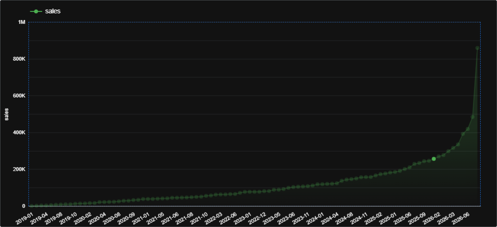
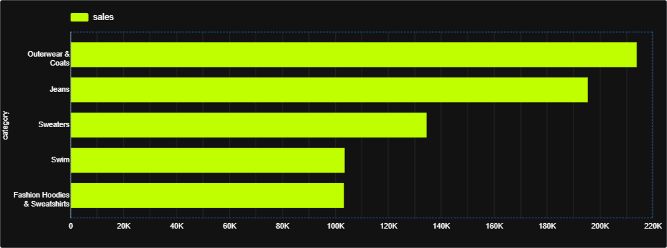
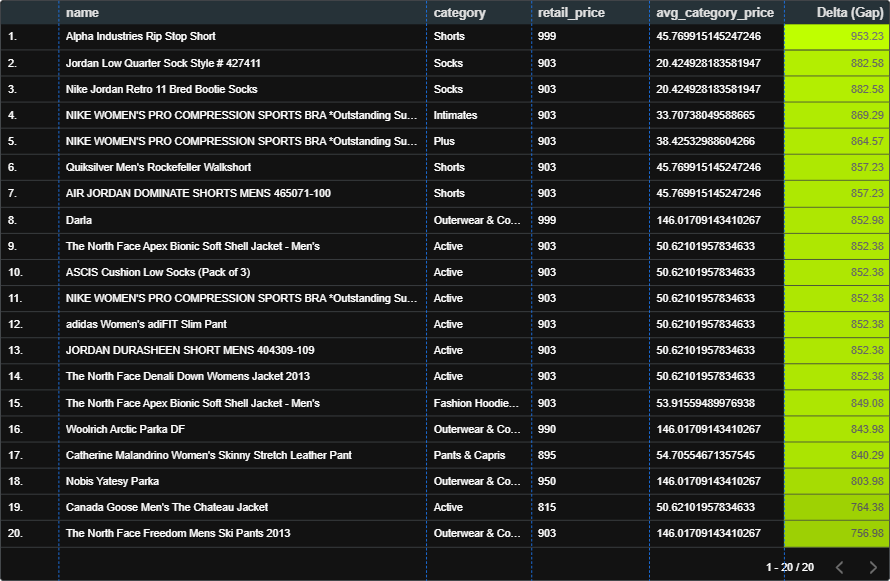
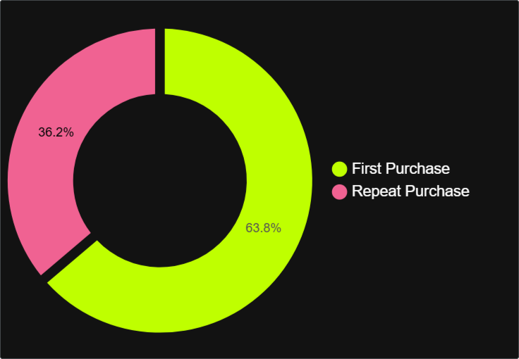
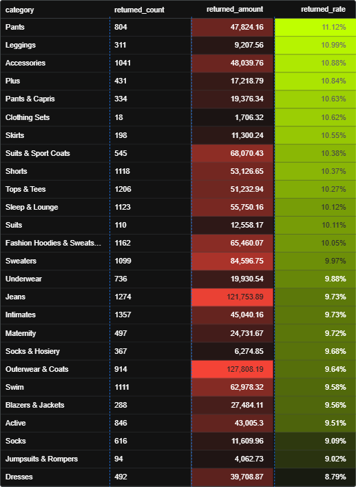
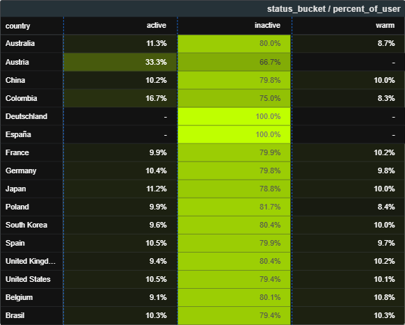

# TheLook E-commerce Performance & Customer Analysis

An end-to-end SQL case study using Google BigQuery to diagnose growth, product performance, pricing, repeat purchasing, returns, and customer health for TheLook, a fictional online fashion retailer.

> **Author:** David Danny  
> **Platform:** Google BigQuery  
> **Visualization:** Looker Studio  
> **Dataset:** `bigquery-public-data.thelook_ecommerce`

## About this Project

TheLook is an online fashion retailer facing slower growth and rising returns. TheLook's leadership needs a focused Q4 plan after growth slowed and returns increased. This project answers six business questions across commercial performance, merchandising, pricing, acquisition versus retention, operational leakage, and market-level customer health. Leadership needs evidence to decide:

1. Whether sales growth is driven by more buyers, more orders, or higher order value.
2. Which categories deserve merchandising and promotional priority.
3. Which products sit far above their category's internal price benchmark.
4. Whether first-time or repeat purchases contribute more to order volume and revenue.
5. Which categories create the greatest return-related revenue leakage.
6. Which country markets have the strongest opportunities for reactivation.

## Tools

- **Google BigQuery** for SQL Query
- **Looker Studio** for result visualization

## Analysis

| No. | Business Question | SQL Query |
|---|---|---|
| 1 | How did monthly sales performance change over time? | [View Query](sql/01_monthly_sales_pulse.sql) |
| 2 | Which categories generated the highest sales in 2024? | [View Query](sql/02_top_categories_2024.sql) |
| 3 | Which products were priced above their category average? | [View Query](sql/03_product_pricing_benchmark.sql) |
| 4 | How do first and repeat purchases compare? | [View Query](sql/04_first_vs_repeat_purchases.sql) |
| 5 | Which categories had the highest return leakage? | [View Query](sql/05_category_return_analysis.sql) |
| 6 | What is the customer health status in each market? | [View Query](sql/06_customer_health_by_market.sql) |

## Visualizations

The SQL query results were visualized using Looker Studio to make the findings easier to understand.

### 1. Monthly Sales Trend



Monthly sales increased over time, while the growth pattern was generally aligned with the increase in orders and unique buyers.

### 2. Top Categories in 2024



Outerwear & Coats generated the highest sales in 2024, followed by Jeans, Sweaters, Swim, and Fashion Hoodies & Sweatshirts.

### 3. Product Pricing Benchmark



Several products were priced significantly above the average retail price of other products in the same category.

### 4. First vs. Repeat Purchases



First purchases contributed 63.8% of total orders, while repeat purchases accounted for 36.2%.

### 5. Category Return Analysis



Pants had the highest returned-sales rate at 11.12%, while Outerwear & Coats recorded the highest returned sales amount.

### 6. Customer Health by Country



Most customers in the larger country segments were classified as inactive, indicating an opportunity for customer reactivation campaigns.

> Note: The visualizations represent the dataset available when the analysis was completed. Results may change because the BigQuery public dataset is updated over time.

## Key Findings

- First purchases contributed 63.8% of total orders.
- Outerwear & Coats was the leading category in the 2024 sales analysis.
- Pants had the highest returned-sales rate at 11.12%.
- Most users in the larger country segments were classified as inactive.

## Recommended Actions

1. **Protect growth quality:** Track buyers, orders per buyer, AOV, repeat rate, and contribution margin together so that acquisition-led growth is not mistaken for stronger engagement.
2. **Prioritize categories with guardrails:** Give leading categories greater visibility only after validating margin, inventory coverage, and return exposure.
3. **Review extreme price gaps:** Validate product records, then test premium messaging, bundling, or pricing for products far above their category average.
4. **Improve the first-to-second-order journey:** Pair acquisition investment with onboarding and lifecycle experiments designed to convert first-time customers into repeat buyers.
5. **Use a two-axis return strategy:** Investigate Pants, Leggings, and Accessories for high return rates, while targeting Outerwear & Coats and Jeans for high returned-value leakage.
6. **Segment win-back campaigns:** Prioritize high-value churned users in the largest markets and measure incremental reactivation rather than relying on broad discounts.

## Repository Structure

```text
thelook-ecommerce-sql-analysis/
├── README.md
├── sql/
│   ├── 01_monthly_sales_pulse.sql
│   ├── 02_top_categories_2024.sql
│   ├── 03_product_pricing_benchmark.sql
│   ├── 04_first_vs_repeat_purchases.sql
│   ├── 05_category_return_analysis.sql
│   └── 06_customer_health_by_market.sql
├── assets/
│   ├── monthly-sales-trend.png
│   ├── top-categories-2024.png
│   ├── product-pricing-benchmark.png
│   ├── first-vs-repeat-purchases.png
│   ├── category-return-analysis.png
│   └── customer-health-by-country.png
├── data/
    └── README.md
```

## Credits

- Case study prompt: Digica Mini Bootcamp
- Dataset: Google BigQuery public dataset, `bigquery-public-data.thelook_ecommerce`
- Analysis and visualization: David Danny

The raw data is not stored in this repository because it is queried directly from BigQuery. Results may change as the public dataset is refreshed.
